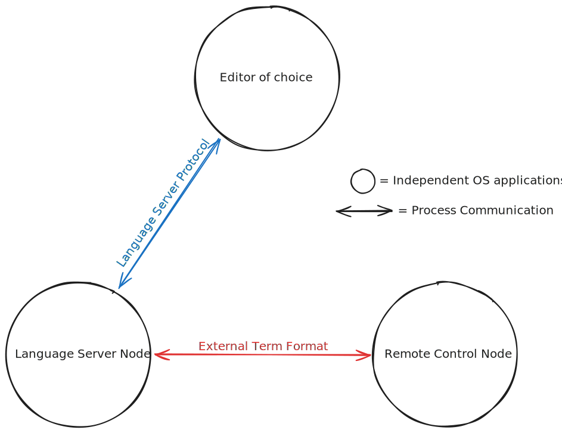

# A contributors guide to understanding lexical.
In many ways, lexical has been designed to be easy to contribute to and work on. This guide is designed to bootstrap contributors with the knowledge necessary to understand lexical's internal workings and make meaningful contributions.

## Node level architecture
When started by the `start_lexical.sh` command, lexical boots an erlang virtual machine that runs the language server and its code. It then boots a separate virtual machine that runs your project code and connects them via distribution. This provides the following benefits:

* None of lexical's dependencies will conflict with the projects it analyzes. This means that lexical can make use of dependencies to make developing in it easier without having to "vendor" them. It also means that you can use lexical to work on your project, even if lexical depends on your project.
    
* Your project can depend on a different version of elixir and erlang than lexical itself. This means that lexical can make use of the latest versions of elixir and erlang while still supporting projects that run on older versions.
    
* The build environment for a project is only aware of itself, which enables as-you-type compilation and error reporting.

## Project structure
lexical is structured as an umbrella app with the following sub-apps:

  * `server` The language server itself.
  * `remote_control` - The application that's injected into a project's code, which gives lexical an API to do things in the context of specific projects.
  * `common` - Contains code shared between the sub-apps.
  * `protocol` - Code related to speaking the language server protocol.
  * `proto` - Used by `protocol` to generate the Elixir representation of LSP data structures.

Lexical is an umbrella app so we can control how many dependencies the remote control app has. By separating lexical into sub-applications, each is built as a separate archive, and we can pick and choose which of these applications (and their dependencies) are injected into the project's VM, thus reducing how much contamination the project sees. If lexical was a standard application, adding dependencies to lexical would cause those dependencies to appear in the project's VM, which might cause build issues, version conflicts in mix or other inconsistencies.

Since the `remote_control` app only depends on `common`, `path_glob` and `elixir_sense`, only those applications pollute the project's vm. Keeping `remote_control`'s dependencies to a minimum is a design goal of this architecture.

## LSP message Lifecycles
The [Language Server Protocol Specification](https://microsoft.github.io/language-server-protocol/specifications/lsp/3.17/specification/) establishes three types of messages that editors and language servers may exchange:

* **Request Messages** - A request from the editor to the language server or vice versa. Every processed request must be answered with a response in kind, even if just to acknowledge that it was received.
* **Response Messages** - A response sent as the result of a corresponding request. May contain errors if a request could not be completed.
* **Notification Messages** - An event from the editor to the language server or vice versa that doesn't expect a response.

When a message is received, it must first be parsed either into a **Request** or **Notification**. From there, the language server will directly handle any messages related to the lifecycle of the language server itself:

* Performing initialization and shutdown.
* Processing configuration changes.
* Synchronizing document states.

All other messages are delegated to a _Provider Handler_. This delegation is accomplished by the server process adding the request to the [provider queue](https://github.com/lexical-lsp/lexical/blob/main/apps/server/lib/lexical/server/provider/queue.ex). The provider queue asks the `Lexical.Server.Provider.Handlers.for_request/1` function which handler is configured to handle the request, creates a task for the handler and starts it.

A _Provider Handler_ is just a module that defines a function of arity 2 that takes the request to handle and a `%Lexical.Server.Configuration{}`. These functions can reply to the request, ignore it, or do some other action.
